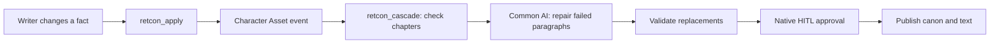

# RETCON

**Every data engineer knows backfill. Novelists call it retcon.**

RETCON is an Airflow 3.3 plugin that checks how a story change affects later chapters, repairs contradictory paragraphs with AI, and lets the writer approve the result.

## Install

Requires Airflow **3.3.x** and Python **3.11–3.13**.

```sh
uv build
pip install dist/airflow_retcon-0.1.0-py3-none-any.whl
retcon configure
```

The wheel includes the writer UI, API, and both DAGs. Airflow loads the plugin through its package entry point; `retcon configure` registers the packaged DAG bundle while preserving existing bundles. Restart your Airflow components after installation.

## Run the local demo

```sh
AIRFLOW__CORE__SIMPLE_AUTH_MANAGER_ALL_ADMINS=True AIRFLOW__API__HOST=127.0.0.1 airflow standalone
```

Open `/plugin/retcon-writer` at your Airflow URL, or choose **Browse → RETCON writer**. This local demo opens without a login form.

In **Settings**, select `google/gemma-4-31b-it:free`, enter your OpenRouter key, test, and save. The key is encrypted in Airflow Connection `retcon_openrouter`; the model is stored in `extra.model`. Settings changes need no restart.

## Try it

1. Open *The Aster Protocol*, the included five-chapter mystery.
2. Select **Mara → dies at the end of chapter 2**.
3. Click **Inspect the ripple**: three chapters depend on Mara, but only two contain broken dialogue.
4. Apply the revision and review the paragraph diffs.
5. Approve or reject. Approval publishes the canon and text together.
6. Export Markdown, continue editing, or reset the sample.

Chapter 5 remembers Mara without giving her live dialogue, so it stays unchanged. Writers can also import Markdown/plain text, edit chapters, inspect failures, and cancel a revision.

## How it works



RETCON identifies story dependencies. Airflow handles asset scheduling, task mapping, retries, and the human decision. Invalid model output gets one corrective attempt; failure leaves the published manuscript intact.

The automated change is a character's death after a chosen chapter. Deterministic checks cover attributed dialogue after death, backwards scene time, and conflicting scene locations. Imported drafts use named dialogue for character indexing; scene times and locations are not inferred.

## State

This is a single-writer demo with one active revision at a time. State lives in `$AIRFLOW_HOME/retcon`. If API and worker processes run on separate hosts, they must share a persistent directory through `RETCON_STATE_DIR`.

## Development

```sh
uv sync --python 3.12
uv run pytest -q
uv run ruff check src tests
uv build
```

Verified on Airflow **3.3.2**: **131 tests pass**, and the real model-to-approval workflow completes successfully.

- [Plugin configuration](docs/PLUGIN.md)
- [Implementation overview](docs/BUILD_PLAN.md)
- [2:45 demo script](docs/DEMO_SCRIPT.md)
- [Verification](docs/VERIFICATION.md)
- [Hackathon brief](docs/JUDGE_BRIEF.md)
- [Submission description](docs/SUBMISSION.md)

MIT licensed. The included fiction is original sample content.
