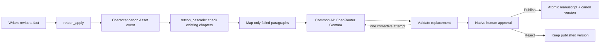

# RETCON

**Every data engineer knows backfill. Novelists call it retcon.**

Change a character's fate. See which later chapters depend on that fact, find the exact contradictions, and approve small repairs. RETCON is an installable **Apache Airflow 3.3 plugin** that puts a writer's workspace over a real Airflow workflow.

The original demo manuscript, *The Aster Protocol*, is a five-chapter locked-room mystery aboard a research station. Declare Mara dead after chapter 2: chapters 3, 4, and 5 depend on her, but only 3 and 4 give her live dialogue. The memory in chapter 5 stays intact.

## Install in Airflow 3.3

RETCON ships as one Python wheel, `airflow-retcon`, containing the plugin, writer UI, API, and both workflow DAGs. It supports Airflow **3.3.x** and Python **3.11–3.13**. Build the wheel from this repository with [uv](https://docs.astral.sh/uv/):

```sh
uv build
```

Install it in your Airflow environment, then register its packaged DAG bundle once:

```sh
pip install /path/to/airflow_retcon-0.1.0-py3-none-any.whl
retcon configure
```

Restart the Airflow API server, scheduler, DAG processor, triggerer, and workers as applicable. Install the same wheel and apply the same bundle configuration on each component. Your existing local, Git, or other DAG bundles remain configured. For configuration-file or environment-managed deployments, see [installation details](docs/PLUGIN.md).

Airflow discovers the plugin through its standard `airflow.plugins` entry point. The registered `RetconDagBundle` lets the DAG processor discover **`retcon_apply`** and **`retcon_cascade`** directly from the installed package. No DAG files need to be copied or generated in your DAG directory.

Open your Airflow URL, sign in, and choose **Browse → RETCON writer**. The workspace is served by that Airflow API server at `/retcon/` and embedded inside the Airflow UI. RETCON does not need a separate web server, Dockerfile, or Astro project. Existing Astro deployments can install the same wheel like any other Airflow deployment.

On first use, open **AI settings**, select an OpenRouter model (default `google/gemma-4-31b-it:free`), enter your API key, test the connection, and save. The key is stored as the password of Airflow Connection **`retcon_openrouter`**, encrypted with the instance's Fernet key. The model is stored in that connection's `extra.model` field and is read by Common AI tasks. A blank key on later edits preserves the saved key. Settings cannot change while a revision is active.

RETCON is a single-user hackathon demo. It reuses Airflow's native session for workflow API calls and adds no app-specific accounts or role system. Provider keys stay on the server. For the local demo, use Airflow's no-login mode below.

Orchestration runs in your Airflow deployment, and affected chapter context is sent to your selected OpenRouter model. Free model availability and quotas can vary. The package declares the Common AI, Standard, and model-client dependencies it requires.

No environment file or engine selection is required. Configure the model and key in the writer's **AI settings**. Do not define `AIRFLOW_CONN_RETCON_OPENROUTER` separately: environment connections take precedence over the metadata database and would hide changes made in the settings UI. See [plugin architecture](docs/PLUGIN.md).

## Start the local demo without a login screen

After installation and `retcon configure`, run Airflow's built-in local demo:

```sh
AIRFLOW__CORE__SIMPLE_AUTH_MANAGER_ALL_ADMINS=True AIRFLOW__API__HOST=127.0.0.1 airflow standalone
```

Open `/plugin/retcon-writer` at the Airflow URL. This is a local-only demo preset; there is no separate RETCON login or account setup.

## Try the demo

1. Read the manuscript, then select **Mara → dies at the end of chapter 2**.
2. Click **Inspect the ripple**. See three dependent chapters, two broken passages, and three chapters that need no rewrite.
3. Apply the revision. Airflow receives the request, emits a real asset event, and schedules the cascade.
4. Open **Continuity** to see the quoted violations. Open **Changes** to inspect the exact paragraph replacements.
5. Approve or reject in the writer workspace. This resolves Airflow's native HITL task. Approval publishes the new canon and patches together; rejection leaves the published story intact.
6. Export Markdown, edit chapters, import a new draft, or reset the demo once the active revision finishes. Use **Cancel revision** to recover an interrupted or unwanted run without changing the published story.

The chapter 2 airlock scene already supports Mara's death; this demo resolves her ambiguous fate in canon. It does not secretly rewrite chapter 2. The revision note records the author's intent; only the structured death-after-chapter fact is automated in this prototype.

## What is real

| Feature | Implementation |
| --- | --- |
| Installable Airflow plugin | Wheel entry point, FastAPI app at `/retcon/`, embedded navigation, session authentication, UI model/key setup |
| Packaged DAG bundle | Native `RetconDagBundle` discovers both DAGs from the installed wheel; one-time registration preserves existing bundles |
| Writer workspace | Read, paste/upload Markdown or text, edit chapters, inspect impact, review diffs, approve/reject, export |
| Explicit dependencies | Character mentions index candidate chapters; a mention is not automatically a violation |
| Deterministic checks | Dead-character dialogue, backwards linear scene time, conflicting scene locations |
| Event scheduling | `retcon_apply` emits `retcon://aster/bible/characters`; `retcon_cascade` is actually asset-scheduled |
| Selective AI repair | Mapped Common AI `@task.llm` calls through a Pydantic AI connection to OpenRouter |
| Bounded repair | Rejected output gets one corrective content attempt; a second failure blocks publication |
| Human control | Native `HITLOperator`, with its response submitted from the writer UI through REST API v2 |
| Publication | File-locked, atomic canon + text update; base-version check and idempotent publish |
| Evidence | Real DAG/run links, persisted activity and findings, exact before/after paragraphs |



RETCON determines story dependencies. Airflow orchestrates the explicitly declared asset and task dependencies. Airflow does not watch arbitrary YAML files or infer narrative meaning. “Backfill” is the product analogy; this prototype emits a canon revision event instead of calling Airflow's historical-interval backfill API. Data-quality findings are red in the writer UI; a successful checker task can correctly report violations without deliberately crashing.

## Scope and limits

- This is a **single-writer prototype**, with one active revision at a time. State defaults to `$AIRFLOW_HOME/retcon` and uses a file lock and atomic replacement. Components running in separate containers or machines must share the same persistent filesystem at `RETCON_STATE_DIR`, with working file locks and atomic rename. A multi-user service should use transactional storage and document-level permissions.
- Checks are deliberately narrow. Explicit dialogue attribution is detected from prose as well as metadata. The system does not prove overall semantic consistency, detect every pronoun reference, or understand every flashback, recording, disguise, or resurrection. Final editorial judgement belongs to the author.
- The shipped retcon operation changes **one character's death-after-chapter fact**. Location and time rules have tested validators; automatically fixing those metadata errors is outside this demo.
- Imported drafts are split by Markdown headings or plain numbered `Chapter N` headings. Named dialogue such as `Mara said` provides a conservative character index; unknown implicit facts are not invented. Imported or manually edited text has no inferred scene time/location metadata. Review the cast before relying on its impact report.
- Model output is staged; invalid or unavailable responses are shown as failures. The published manuscript is preserved. Resubmit a failed revision after fixing the cause. No fake progress, silently substituted model, or replayed generation is used.
- No independent LLM semantic judge or `llm_branch` is claimed. Routing known violations in Python is deterministic; an additional model vote would not establish truth.
- The sample story is intentionally short for an understandable demo. Whole-novel generation, arbitrary new plot twists, external share links, per-patch approvals, and rich DOCX imports are roadmap items.

## Develop and verify

The repository uses a normal `src/` Python package layout. Install [uv](https://docs.astral.sh/uv/) for the development environment:

```sh
uv sync --python 3.12
uv run pytest -q
uv run ruff check src tests
uv build
```

For a local demonstration, use Airflow's own standalone command in an isolated Airflow home:

```sh
export AIRFLOW_HOME="$HOME/airflow-retcon"
uv run retcon configure
uv run airflow standalone
```

Use the URL and sign-in instructions printed by Airflow. The plugin and DAG bundle are the same ones installed from the wheel; this command is a local development convenience.

Tests cover bundle registration, dependency/violation separation, unchanged-text preservation, invalid suggestions, rejected and stale revisions, transactional publication, import/edit/export, API failures, and local origin checks. Check plugin registration and DAG discovery in the configured Airflow environment with:

```sh
airflow plugins
airflow dags list
airflow dags list-import-errors
```

Use `uv run airflow` for these commands in the development environment. The live Airflow version, runtime checks, and known limits are recorded separately in [verification notes](docs/VERIFICATION.md).

## Project and demo plan

- [Judge and venture assessment](docs/JUDGE_BRIEF.md): why keep RETCON, competitor overlap, category, commercial hypotheses.
- [Detailed build plan](docs/BUILD_PLAN.md): eight-hour schedule, product scope, technical design, acceptance criteria.
- [Demo script](docs/DEMO_SCRIPT.md): 2:45 storyboard, exact narration, evidence and recording strategy.
- [Submission draft](docs/SUBMISSION.md): description and features to include with the public repository and video.

The project now also satisfies the named plugin-feature requirement for **Plugin Powerhouse** through `AirflowPlugin.fastapi_apps` and `external_views`. **Airflow Can Do That?!** remains a strong narrative fit; choose one category for the final submission. Common AI and native HITL also run in the real workflow. The [event page](https://www.astronomer.io/events/beyond-the-dag-data-engineering-hackathon-2026/) lists September 24; the [rules](https://www.astronomer.io/events/beyond-the-dag-data-engineering-hackathon-2026/rules/) list September 17 and an older update date. Confirm the applicable submission cutoff with the organizer.

MIT licensed. Original sample fiction is included under the same license. Apache Airflow, OpenRouter, and the model are separate projects with their own terms and licenses.
