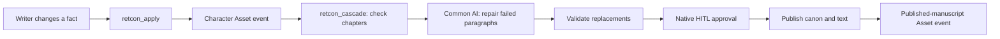

# RETCON

**Every data engineer knows backfill. Novelists call it retcon.**

A character dies in chapter two, but still speaks in chapter three. Fixing that change means finding every affected passage without rewriting the parts that still work.

RETCON turns that problem into an Airflow workflow. Its embedded writer workspace lets an author inspect continuity failures, compare AI-generated paragraph repairs, approve or reject the revision, and export the manuscript as Markdown.

Packaged as an installable Apache Airflow 3.3 plugin, RETCON includes the writer UI, API, and a native DAG bundle. Writers can import a draft, edit chapters, and review revisions without leaving the workspace.

**[Watch the 2:23 demo](https://youtu.be/A4f05--U_RM)** · [Explore the interactive walkthrough](https://app.supademo.com/demo/cmufw8btg06hnqm3kqghk1kf1)

## Quick start

Choose Docker or a Python virtual environment. Both start a local Airflow 3.3.2 demo, register RETCON's DAGs, and open without a login form. No environment file or manual Airflow setup is needed.

### Docker

Requires Docker with Compose.

```sh
docker compose up --build
```

Open **http://localhost:8080/plugin/retcon-writer**. Stop with `Ctrl+C` or `docker compose down`. Stories, settings, and the Airflow database stay in the Docker volume.

For another port:

```sh
RETCON_PORT=8082 docker compose up --build
```

### Project virtual environment

On macOS or Linux, install [uv](https://docs.astral.sh/uv/getting-started/installation/), then run:

```sh
./scripts/local-demo
```

The launcher creates `.venv`, installs the locked dependencies and RETCON, and runs Airflow directly from that environment. Open **http://127.0.0.1:8080/plugin/retcon-writer**. Stop with `Ctrl+C`; data is kept in `.retcon/local`.

For another port:

```sh
./scripts/local-demo --port 8082
```

The two options keep separate data. The first installation downloads Airflow and its dependencies, so it can take a few minutes.

### Connect the model

In **Settings**, select `google/gemma-4-31b-it:free`, enter your OpenRouter key, test, and save. The key is encrypted in Airflow Connection `retcon_openrouter`; the model is stored in `extra.model`. Settings changes need no restart.

## Install in an existing Airflow environment

Requires Airflow **3.3.x** and Python **3.11–3.13**.

```sh
uv build
pip install dist/airflow_retcon-0.1.0-py3-none-any.whl
retcon configure
```

Restart your Airflow components. The wheel includes the writer UI, API, and both DAGs; bundle registration preserves your existing DAG bundles.

## Try it

1. Open *The Aster Protocol*, the included five-chapter mystery.
2. Select **Mara → dies at the end of chapter 2**.
3. Click **Inspect the ripple**: three chapters depend on Mara, but only two contain broken dialogue.
4. Apply the revision and review the paragraph diffs.
5. Approve or reject. Approval publishes the canon and text together.
6. Export Markdown, continue editing, or reset the sample.

The result: **3 dependent chapters checked, 2 contradictory paragraphs repaired, and 3 chapters untouched.** Chapter 5 remembers Mara without giving her live dialogue, so it stays unchanged. Writers can also inspect failures and cancel a revision.

## How it works



A character-canon Asset event triggers `retcon_cascade`. RETCON identifies the affected passages and checks them against the proposed canon. Dynamic task mapping sends only failing paragraphs to the Common AI provider's `@task.llm`.

RETCON validates each replacement and gives rejected suggestions one corrective attempt. A native `HITLOperator` then waits for the author's decision, submitted through the writer UI using Airflow REST API v2. Approval publishes the manuscript and canon together and emits a published-manuscript Asset event. Rejection or failure leaves the published manuscript intact.

RETCON maintains manuscript and chapter versions; Airflow Asset events carry the revision ID that connects the workflows. “Backfill for stories” is the analogy: the demo uses asset-triggered revision runs, not Airflow's historical backfill endpoint.

## Airflow features used

| Feature | Role in RETCON |
| --- | --- |
| `AirflowPlugin`, `fastapi_apps`, and `external_views` | Host the writer UI and API inside Airflow |
| Native DAG bundle | Discover the packaged workflows without copying DAG files |
| Assets, event metadata, and asset-triggered scheduling | Connect a character-canon change to its repair workflow |
| TaskFlow and dynamic task mapping | Check dependent chapters and create repair tasks only for failing paragraphs |
| Common AI `@task.llm` and Airflow Connections | Run model calls using the model and credential configured in the writer UI |
| Task retries and corrective repair | Retry task failures and give invalid replacements one attempt with validation feedback |
| Native `HITLOperator` and REST API v2 | Pause for the author's decision and resume from the writer workspace |
| Published-manuscript output Asset | Record successful publication as an Asset event |

Built with **Python, Apache Airflow 3.3, FastAPI, the Common AI provider, OpenRouter, Gemma, HTML, CSS, JavaScript, and Docker**.

## Design challenges

The main challenge was separating story knowledge from orchestration. Airflow does not understand fictional continuity, so RETCON maintains explicit character references and deterministic checks, while Airflow schedules and coordinates the work.

Generated prose cannot be trusted just because the model says it is valid. Replacements are checked before review and again before publication. The author's decision resumes a native Airflow HITL task, while the original manuscript remains intact until approval.

## Scope and state

The automated change is a character's death after a chosen chapter. Deterministic checks cover attributed dialogue after death, backwards scene time, and conflicting scene locations. Imported drafts use named dialogue for character indexing; scene times and locations are not inferred.

This is a single-writer demo with one active revision at a time. State lives in `$AIRFLOW_HOME/retcon`. If API and worker processes run on separate hosts, they must share a persistent directory through `RETCON_STATE_DIR`.

## Development

```sh
uv sync --python 3.12
uv run pytest -q
uv run ruff check src tests
uv build
```

Verified on Airflow **3.3.2**: **131 tests pass**, and the real model-to-approval workflow completes successfully.

- [Plugin configuration](docs/PLUGIN.md)
- [Implementation overview](docs/BUILD_PLAN.md)
- [2:45 demo script](docs/DEMO_SCRIPT.md)
- [Verification](docs/VERIFICATION.md)
- [Hackathon brief](docs/JUDGE_BRIEF.md)
- [Submission description](docs/SUBMISSION.md)

MIT licensed. The included fiction is original sample content.
