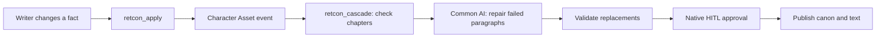

# RETCON

**Every data engineer knows backfill. Novelists call it retcon.**

RETCON is an Airflow 3.3 plugin that checks how a story change affects later chapters, repairs contradictory paragraphs with AI, and lets the writer approve the result.

## Quick start

Choose Docker or a Python virtual environment. Both start a local Airflow 3.3.2 demo, register RETCON's DAGs, and open without a login form. No environment file or manual Airflow setup is needed.

### Docker

Requires Docker with Compose.

```sh
docker compose up --build
```

Open **http://localhost:8080/plugin/retcon-writer**. Stop with `Ctrl+C` or `docker compose down`. Stories, settings, and the Airflow database stay in the Docker volume.

For another port:

```sh
RETCON_PORT=8082 docker compose up --build
```

### Project virtual environment

On macOS or Linux, install [uv](https://docs.astral.sh/uv/getting-started/installation/), then run:

```sh
./scripts/local-demo
```

The launcher creates `.venv`, installs the locked dependencies and RETCON, and runs Airflow directly from that environment. Open **http://127.0.0.1:8080/plugin/retcon-writer**. Stop with `Ctrl+C`; data is kept in `.retcon/local`.

For another port:

```sh
./scripts/local-demo --port 8082
```

The two options keep separate data. The first installation downloads Airflow and its dependencies, so it can take a few minutes.

### Connect a model

Open **Settings** and choose a provider:

| Provider | Model | API base URL | Key |
| --- | --- | --- | --- |
| OpenRouter | `google/gemma-4-31b-it:free` | Managed automatically | Required |
| LM Studio / OpenAI-compatible | `qwen3.8-27b-uncensored-mlx` or your server's model ID | Your server's `/v1` URL | Optional |

For LM Studio, start its local server on port 1234 and load the model. Use `http://127.0.0.1:1234/v1` with the Python launcher or `http://host.docker.internal:1234/v1` with Docker Desktop. The UI supplies the matching default. Docker and LM Studio must be able to reach each other; browser CORS settings are not needed because Airflow makes the requests.

Click **Test connection**, then **Save**. Model, endpoint, and key are stored in Airflow Connection `retcon_openrouter`; settings changes need no restart. A blank key retains the saved key only for the same provider and endpoint. Switching providers or endpoints does not forward the old key.

## Install in an existing Airflow environment

Requires Airflow **3.3.x** and Python **3.11–3.13**.

```sh
uv build
pip install dist/airflow_retcon-0.1.0-py3-none-any.whl
retcon configure
```

Restart your Airflow components. The wheel includes the writer UI, API, and both DAGs; bundle registration preserves your existing DAG bundles.

## Try it

1. Open *The Aster Protocol*, the included five-chapter mystery.
2. Select **Mara → dies at the end of chapter 2**.
3. Click **Inspect the ripple**: three chapters depend on Mara, but only two contain broken dialogue.
4. Apply the revision and review the paragraph diffs.
5. Approve or reject. Approval publishes the canon and text together.
6. Export Markdown, continue editing, or reset the sample.

Chapter 5 remembers Mara without giving her live dialogue, so it stays unchanged. Writers can also import Markdown/plain text, edit chapters, inspect failures, and cancel a revision.

## How it works



RETCON identifies story dependencies. Airflow handles asset scheduling, task mapping, retries, and the human decision. Invalid model output gets one corrective attempt; failure leaves the published manuscript intact.

The automated change is a character's death after a chosen chapter. Deterministic checks cover attributed dialogue after death, backwards scene time, and conflicting scene locations. Imported drafts use named dialogue for character indexing; scene times and locations are not inferred.

## State

This is a single-writer demo with one active revision at a time. State lives in `$AIRFLOW_HOME/retcon`. If API and worker processes run on separate hosts, they must share a persistent directory through `RETCON_STATE_DIR`.

## Development

```sh
uv sync --python 3.12
uv run pytest -q
uv run ruff check src tests
uv build
```

Verified on Airflow **3.3.2**: **131 tests pass**, and the real model-to-approval workflow completes successfully.

- [Plugin configuration](docs/PLUGIN.md)
- [Implementation overview](docs/BUILD_PLAN.md)
- [2:45 demo script](docs/DEMO_SCRIPT.md)
- [Verification](docs/VERIFICATION.md)
- [Hackathon brief](docs/JUDGE_BRIEF.md)
- [Submission description](docs/SUBMISSION.md)

MIT licensed. The included fiction is original sample content.
